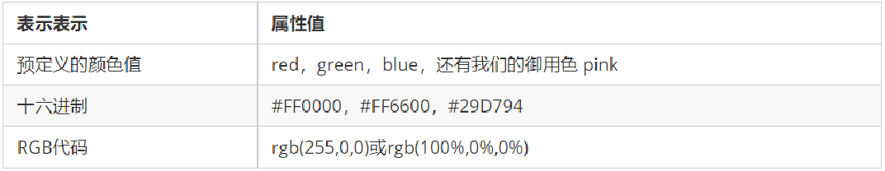
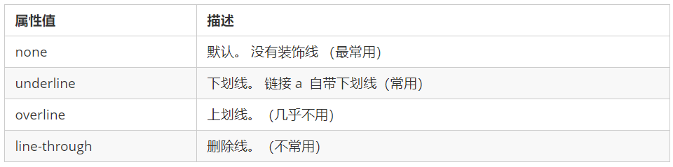
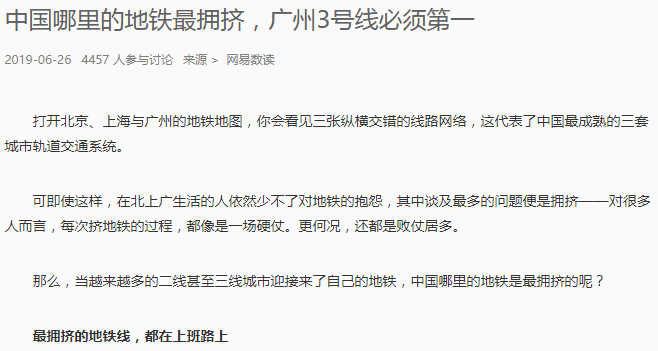
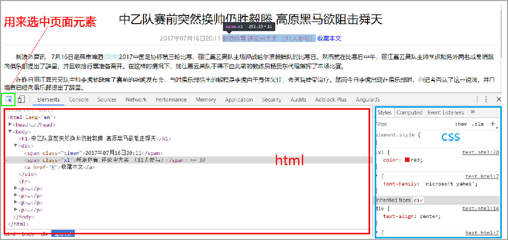

##css第一天总结
###css简介
    CSS 是层叠样式表 ( Cascading Style Sheets ) 的简称.
    有时我们也会称之为 CSS 样式表或级联样式表。
    CSS 是也是一种标记语言
    CSS 主要用于设置 HTML 页面中的文本内容（字体、大小、对齐方式等）、图片的外形（宽高、边框样式、边距等）以及版面的布局和外观显示样式。
    CSS 让我们的网页更加丰富多彩，布局更加灵活自如。简单理解：CSS 可以美化 HTML , 让 HTML 更漂亮， 让页面布局更简单。
    CSS 最大价值: 由 HTML 专注去做结构呈现，样式交给 CSS，即 结构 ( HTML ) 与样式( CSS ) 相分离

###css语法规范
    1.使用 HTML 时，需要遵从一定的规范，CSS 也是如此。要想熟练地使用 CSS 对网页进行修饰，首先需要了解CSS 样式规则。
    2.CSS 规则由两个主要的部分构成：选择器以及一条或多条声明。

 1.选择器是用于指定 CSS 样式的 HTML 标签，花括号内是对该对象设置的具体样式
 2.属性和属性值以“键值对”的形式出现
 3.属性是对指定的对象设置的样式属性，例如字体大小、文本颜色等
 4.属性和属性值之间用英文“:”分开
 5.多个“键值对”之间用英文“;”进行区分
 例如：
    所有的样式，都包含在 
    </head>

### css代码风格：
    1. 样式格式书写
        1.紧凑格式   
            h3 { color: deeppink;font-size: 20px;}
        2.展开格式   
         h3 {
            color: pink;
            font-size: 20px;    
         }
        强烈推荐第二种格式， 因为更直观。
        2. 样式大小写风格
        1.小写格式
                h3 {
                color: pink;
                }
        2.大写格式
                  H3 {
                COLOR: PINK;   
                }
            强烈推荐样式选择器，属性名，属性值关键字全部使用小写字母，特殊情况除外。
            3. 样式空格风格
        1. h3 {
            color: pink;    
        }
        属性值前面，冒号后面，保留一个空格
        选择器（标签）和大括号中间保留空格
### css选择器的作用

​    答：选择器(选择符)就是根据不同需求把不同的标签选出来这就是选择器的作用。  简单来说，就是选择标签用的。
​    
​    找到所有的 h1 标签。  选择器（选对人）
​    设置这些标签的样式，比如颜色为红色（做对事）。

## css基础选择器

基础选择器又包括：标签选择器、类选择器、id 选择器和通配符选择器
### 标签选择器：
​    标签选择器（元素选择器）是指用 HTML 标签名称作为选择器，按标签名称分类，为页面中某一类标签指定统一的 CSS 样式。
语法：
​    标签选择器{
​        属性：属性值
​        ...
​    }
作用：
​    标签选择器（元素选择器）是指用 HTML 标签名称作为选择器，按标签名称分类，为页面中某一类标签指定统一的 CSS 样式。
### 类选择器
​    如果想要差异化选择不同的标签，单独选一个或者某几个标签，可以使用类选择器.
语法：
​    .类名 {
​        属性1: 属性值1;  
​        ...
​    } 
​    结构需要用class属性来调用  class  类的意思

     
 变红色 

​    1.如果想要差异化选择不同的标签，单独选一个或者某几个标签，可以使用类选择器。
​    2.类选择器在 HTML 中以 class 属性表示，在 CSS 中，类选择器以一个点“.”号显示。
​    3.类选择器使用“.”（英文点号）进行标识，后面紧跟类名（自定义，我们自己命名的）。
​    4.可以理解为给这个标签起了一个名字，来表示。
​    5.长名称或词组可以使用中横线来为选择器命名。
​    6.不要使用纯数字、中文等命名，尽量使用英文字母来表示。
​    7.命名要有意义，尽量使别人一眼就知道这个类名的目的。
​    8.命名规范：见附件（ Web 前端开发规范手册.doc）
### 多类名选择器
​    我们可以给一个标签指定多个类名，从而达到更多的选择目的。 这些类名都可以选出这个标签.
​    简单理解就是一个标签有多个名字. 

    多类名的具体使用：
        1. 
亚瑟

        注意：
        ​        1.在标签class 属性中写 多个类名
        ​        2.多个类名中间必须用空格分开
        ​        3.这个标签就可以分别具有这些类名的样式
### id选择器：
​    id 选择器可以为标有特定 id 的 HTML 元素指定特定的样式。
​    HTML 元素以 id 属性来设置 id 选择器，CSS 中 id 选择器以“#" 来定义。
​    语法：
​         #id名 {
​            属性1: 属性值1;  
​            ...
​        } 
​        注意：id 属性只能在每个 HTML 文档中出现一次
### id选择器和类选择器的区别：
​    1.类选择器（class）好比人的名字，一个人可以有多个名字，同时一个名字也可以被多个人使用。
​    2.id 选择器好比人的身份证号码，全中国是唯一的，不得重复。
​    3.id 选择器和类选择器最大的不同在于使用次数上。
​    4.类选择器在修改样式中用的最多，id 选择器一般用于页面唯一性的元素上，经常和 JavaScript 搭配使用。

###通配符选择器：
    语法：
        * {
            属性1: 属性值1;  
            ...
                }
        通配符选择器不需要调用， 自动就给所有的元素使用样式
        特殊情况才使用，后面讲解使用场景(以下是清除所有的元素标签的内外边距,后期讲)
          * {
            margin: 0;
            padding: 0;
                } 
### 选择器总结

## css字体属性:
### 字体大小：
​    CSS 使用 font-size 属性定义字体大小。 
语法：
​     p {  
​        font-size: 20px; 
​    }
​    1.px（像素）大小是我们网页的最常用的单位
​    2.谷歌浏览器默认的文字大小为16px
​    3.不同浏览器可能默认显示的字号大小不一致，我们尽量给一个明确值大小，不要默认大小
​    4.可以给 body 指定整个页面文字的大小

### 字体粗细：

​    CSS 使用 font-weight 属性设置文本字体的粗细。
语法：
​    p {  
​        font-weight: bold; 
​    }

1.学会让加粗标签（比如 h 和 strong 等) 不加粗，或者其他标签加粗
2.实际开发时，我们更喜欢用数字表示粗细
### 字体样式：
​    CSS 使用 font-style 属性设置文本的风格。
语法：
​    p {  
​        font-style: normal;
​    }

### 字体的综合写法

字体属性可以把以上文字样式综合来写, 这样可以更节约代码:

 body {   font: font-style  font-weight  font-size/line-height  font-family;}

使用 font 属性时，必须按上面语法格式中的顺序书写，不能更换顺序，并且各个属性间以空格隔开 不需要设置的属性可以省略（取默认值），但必须保留 font-size 和 font-family 属性，否则 font 属性将不起作用

### 字体总结：

## css文本属性：
### 文本颜色：

​    color 属性用于定义文本的颜色。
语法：
​    div { 
​        color: red;
​    }

开发中最常用的是十六进制
### 文本对齐：
text-align 属性用于设置元素内文本内容的水平对齐方式。
语法：
    div { 
        text-align: center;
    }

### 修饰文本：
​    语法：
​     div { 
​        text-decoration：underline；
​     }

重点记住如何添加下划线 ? 如何删除下划线 ? 其余了解即可.

### 文本缩进
语法：
    div { 
        text-indent：20px；
    }
    div { 
        text-indent：2em；
    }

    em 是一个相对单位，就是当前元素（font-size) 1 个文字的大小, 如果当前元素没有设置大小，则会按照父元素的 1 个文字大小。
### 行间距：
​    line-height 属性用于设置行间的距离（行高）。可以控制文字行与行之间的距离
语法：
​    p { 
​        line-height: 26px;
​    }
​    行高的文本分为 上间距  文本高度 下间距 = 行间距

## Chrome调试工具：

 1.Ctrl+滚轮 可以放大开发者工具代码大小。
 2.左边是 HTML 元素结构，右边是 CSS 样式。
 3.右边 CSS 样式可以改动数值（左右箭头或者直接输入）和查看颜色。
 4.Ctrl + 0 复原浏览器大小。
 5.如果点击元素，发现右侧没有样式引入，极有可能是类名或者样式引入错误。
 6.如果有样式，但是样式前面有黄色叹号提示，则是样式属性书写错误。
